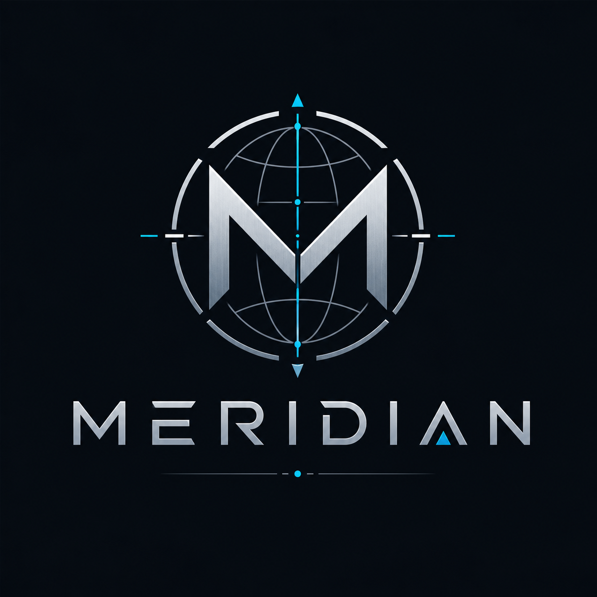
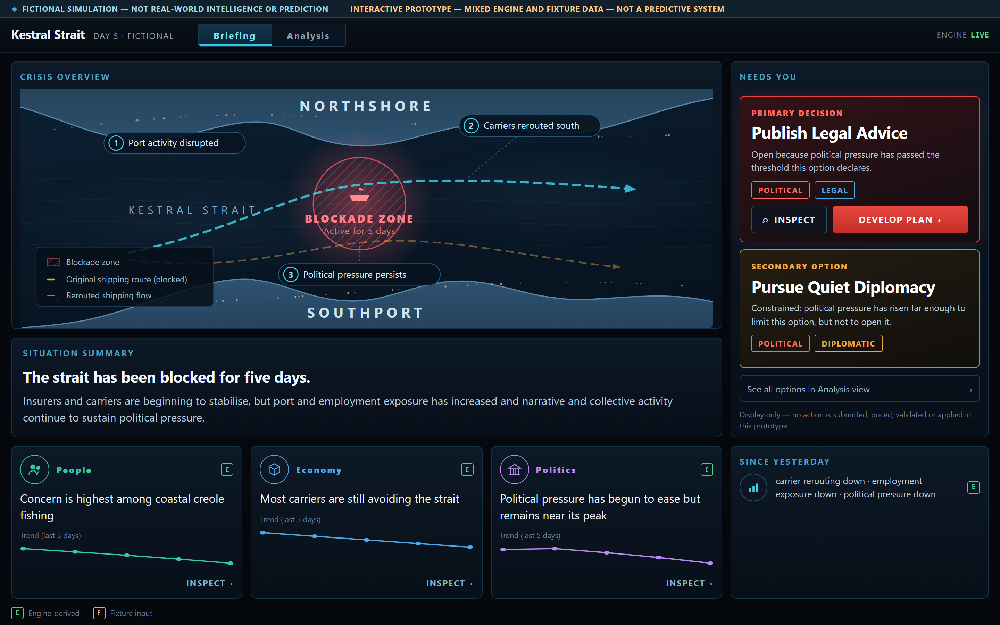

<p align="center">
  
</p>

<h1 align="center">MERIDIAN</h1>

<h3 align="center">Simulated societies, built from first principles</h3>

<p align="center">
  An early simulated-society platform. It traces how a single crisis moves through a fictional
  society — insurers, shipping, employment, households, narratives and political decisions —
  one deterministic mechanism at a time.
</p>

<p align="center">
  <a href="../../actions/workflows/ci.yml"></a>
  
  
</p>

> ### ◈ FICTIONAL SIMULATION — NOT REAL-WORLD INTELLIGENCE OR PREDICTION
>
> Kestral Strait is an invented place. MERIDIAN models **no real nations, organisations or
> individuals**, and no output describes, forecasts or assesses real events. This is a research and
> engineering project for exploring societal dynamics in **fictional** environments.

<p align="center">
  
</p>

---

## What you're seeing

The Briefing view presents the fictional Kestral Strait crisis as a situation report rather than a
dashboard:

- a **crisis map** with the blockade zone, the original (blocked) route and the rerouted flow;
- a **situation summary** in plain English;
- one **primary decision** with its affected domains;
- **People / Economy / Politics** consequence cards, each with a five-day trend;
- **E / F origin markers** distinguishing engine-computed values from fixture content;
- a persistent fictional-simulation disclosure.

Every sentence on that screen is **derived from the run's own state** — not written into the
interface. Change the run and the wording changes with it. A deeper **Analysis view** holds exact
values, mechanism identifiers, provenance and rule-pack detail, one click away.

## What MERIDIAN demonstrates today

A fictional maritime blockade carried through **nine linked mechanisms** to political consequence,
with every step inspectable, any mechanism switchable off to see what it was carrying, and the
interface visibly distinguishing engine-derived from fixture-backed information.

| # | Stage | What happens |
|---|---|---|
| 1 | Incident | The strait is blockaded |
| 2 | Insurer risk | Insurers reprice risk on the route |
| 3 | Carrier rerouting | Higher premiums push shipping onto longer paths |
| 4 | Port activity | Rerouted traffic means less work at the quayside |
| 5 | Employment exposure | Port-dependent work becomes less secure |
| 6 | Household concern | Weighted by how exposed each cohort actually is |
| 7 | Narrative attention | The disruption becomes something people discuss |
| 8 | Collective activity | Attention turns into coordinated response |
| 9 | Political pressure | Which opens or constrains government options |

**The ordering is the point.** These stages peak in sequence — incident at tick 1, insurer risk at 6,
rerouting at 7, employment at 9, households at 10, narrative at 13, collective activity at 16,
political pressure at 17. Political pressure is still near its peak while every upstream indicator
has already fallen, because it lags its causes and decays more slowly.

**Effects keep propagating through a society after the original disruption begins to ease.** That is
the idea MERIDIAN exists to make visible.

## Baseline, incident and counterfactual

Three runs, which is what makes the causal claim checkable rather than asserted:

- **Baseline** — the incident removed entirely. Nothing propagates.
- **Incident** — the blockade occurs and the chain runs.
- **Counterfactual** — the incident is **kept** but one named mechanism is disabled.

Disabling `M-CARRIER-REROUTE` leaves everything upstream **bit-identical** and collapses everything
downstream of the removed link. That is how you tell a real causal channel from a coincidence.
**All nine mechanisms can be disabled independently.**

## Status

| Capability | Status |
|---|---|
| Nine-stage cross-tier societal-response mechanism | **IMPLEMENTED** |
| Authoritative state, single mutation boundary | **IMPLEMENTED** |
| Isolated deterministic randomness (keyed, counter-based) | **IMPLEMENTED** |
| Versioned rule packs | **IMPLEMENTED** |
| Population-weighted cohort effects · declared lags, cooldowns, recovery | **IMPLEMENTED** |
| Baseline / incident / counterfactual runs | **IMPLEMENTED** |
| Read-only presentation projection with per-record origin | **IMPLEMENTED** |
| B5 fictional-world technical controls | **IMPLEMENTED** |
| Hosted CI | **IMPLEMENTED** |
| Briefing and Analysis interface | **PROTOTYPE UI** — mixes engine output with fixture content |
| Persistent people and organisations | **PLANNED** (v0.2) |
| Proposition-level belief modelling | **PLANNED** (v0.3) |
| Controlled LLM integration | **PLANNED** (v0.5) |
| Events, hashes, restore and replay | **PLANNED** (v0.6) |
| Synthetic societies of persistent virtual people | **LONG-TERM VISION** |
| Real-world targeting or operational intelligence | **EXPLICIT NON-GOAL** |

Only **IMPLEMENTED** rows describe working software. The authority for what may be claimed is
[`docs/delivery/CAPABILITY-CLAIMS.md`](docs/delivery/CAPABILITY-CLAIMS.md).

## Run it locally

```bash
# Backend — API on :8000
cd scaffold/backend
pip install -r requirements.txt
pip install --no-deps -r requirements-mesa.txt   # separate on purpose; the file explains why
python -m pytest tests -q                        # 187 tests
uvicorn app.main:app --reload

# Frontend — UI on :5173
cd scaffold/frontend
npm install
npm test                                         # 64 tests
npm run dev
```

Open <http://localhost:5173>. The screen loads a live incident run; the chip reads `ENGINE LIVE` when
it is showing genuine engine output. Switch to **Analysis** for exact values and mechanism detail.

## Architecture in plain language

The engine is the only thing allowed to decide what is true. It reads a scenario, runs mechanisms in
a fixed order, and writes every change through **one** boundary, so no part of the system can quietly
alter state behind another's back.

Randomness is keyed rather than sequential: each draw derives from its own identifier, so adding a
draw in one subsystem cannot silently shift results elsewhere. That was a real defect, found by
perturbation-testing the original shared generator, and fixing it was its own workstream.

Everything the interface shows is a **read-only projection**. The UI cannot write to the simulation.

## Technical architecture

- **Backend** — Python 3.12, FastAPI, Pydantic v2, Mesa. Every mutation passes through
  `TransitionService` with a closed transition vocabulary.
- **Determinism** — HMAC-SHA-256 keyed draws (`hmac-sha256-v1`), named substreams per mechanism.
- **Rule packs** — coefficients, thresholds, lags and decay are versioned data
  (`kestral-causal-slice@1.0.0`), not inline constants.
- **Mechanisms** — nine, each with stable id, version, declared source and target fields, lag and
  lifecycle, emitting causal-parent references.
- **Frontend** — Vite + TypeScript, no framework. Original SVG visuals, no map service.
- **CI** — GitHub Actions on `windows-latest`: install, import smoke test, packaging check, tests.

## Safety controls

MERIDIAN enforces its fictional-world boundary **in code**, not only in documentation. Eight controls
are implemented and tested — see [`docs/safety/B5-TECHNICAL-CONTROLS.md`](docs/safety/B5-TECHNICAL-CONTROLS.md):

fail-closed fictional manifest · packaged-scenario allowlist · fictional target registry ·
protected-trait exclusion · no persuadability optimisation · no real-population manipulation
recommendations · persistent fictional disclosure surviving cropping · per-element provenance where
`UNKNOWN` and `UNAVAILABLE` never render as zero.

Aggregate fictional narrative propagation and comparison of pre-authored **defensive** interventions
remain permitted. Audience targeting, susceptibility ranking and real-world influence recommendations
do not.

## Known limitations

Stated plainly, because an honest boundary is more useful than an impressive one:

- **One scenario.** Kestral Strait is the only runnable fictional scenario.
- **No persistence.** Nothing is written to a database; a run is discarded when the request completes.
- **No replay, no event sourcing.** There is no restore path and no state hashing.
- **No language model is called.** No module in the authoritative path imports a model or HTTP client.
- **No belief modelling.** The engine models cohort-level concern, not what individual people believe.
- **Player decisions do not reach the tick loop.** They are recorded and have no effect.
- **The interface is a prototype** mixing engine output with fixture content; the distinction is
  marked on screen.
- **No accessibility conformance is claimed.** Dark theme only.
- **Not predictive.** The engine computes a fictional world under declared rules. It does not
  estimate this one.

## Roadmap — two horizons

**Horizon 1 (this release)** — a credible, understandable release of what is actually built.

**Horizon 2** — the long-term goal is a multi-agent synthetic-society modelling platform built from
first principles for examining information propagation and evaluating defensive interventions in
fictional environments: persistent fictional people and organisations with identity, relationships,
beliefs and memory. **That is a direction, not a current capability.**

v0.2 persistent agents · v0.3 belief, trust and exposure · v0.4 narrative competition and
intervention comparison · v0.5 controlled LLM integration · v0.6 events, hashes and replay ·
v0.7 scenario authoring · v1.0 stable platform.

Detail: [`PROJECT-ROADMAP.md`](PROJECT-ROADMAP.md) ·
[`docs/vision/VIRTUAL-PERSONS-AND-SYNTHETIC-SOCIETIES.md`](docs/vision/VIRTUAL-PERSONS-AND-SYNTHETIC-SOCIETIES.md)

## Documentation

| Document | What it is |
|---|---|
| [`CHARTER.md`](CHARTER.md) | Governing design principles and the eight questions every state change must answer |
| [`PROJECT-ROADMAP.md`](PROJECT-ROADMAP.md) | The two horizons and the release map |
| [`docs/delivery/CAPABILITY-CLAIMS.md`](docs/delivery/CAPABILITY-CLAIMS.md) | What may and may not be claimed, with evidence |
| [`docs/delivery/P0-5-CAUSAL-SLICE.md`](docs/delivery/P0-5-CAUSAL-SLICE.md) | The nine-mechanism chain and its counterfactual verification |
| [`docs/delivery/P0-4A-RANDOMNESS.md`](docs/delivery/P0-4A-RANDOMNESS.md) | Keyed deterministic draws, and why the shared generator was a defect |
| [`docs/safety/B5-TECHNICAL-CONTROLS.md`](docs/safety/B5-TECHNICAL-CONTROLS.md) | The eight controls, mapped to implementation and tests |
| [`docs/design/USABILITY-RULES.md`](docs/design/USABILITY-RULES.md) | The interface rules this project holds itself to |
| [`docs/SCREENSHOTS.md`](docs/SCREENSHOTS.md) | Current interface captures |
| [`docs/BRANCHING.md`](docs/BRANCHING.md) | Branch model and contribution workflow |
| [`docs/world-model/`](docs/world-model/) | Long-range specifications — **specification, not implementation** |

## Licence and contributions

**Source available — all rights reserved.** No licence is granted, and this is **not** open-source
software. See [`NOTICE.md`](NOTICE.md).

Issues and feedback are welcome. Unsolicited code contributions are not currently accepted pending
contribution terms — see [`CONTRIBUTING.md`](CONTRIBUTING.md) and
[`SECURITY.md`](SECURITY.md).
