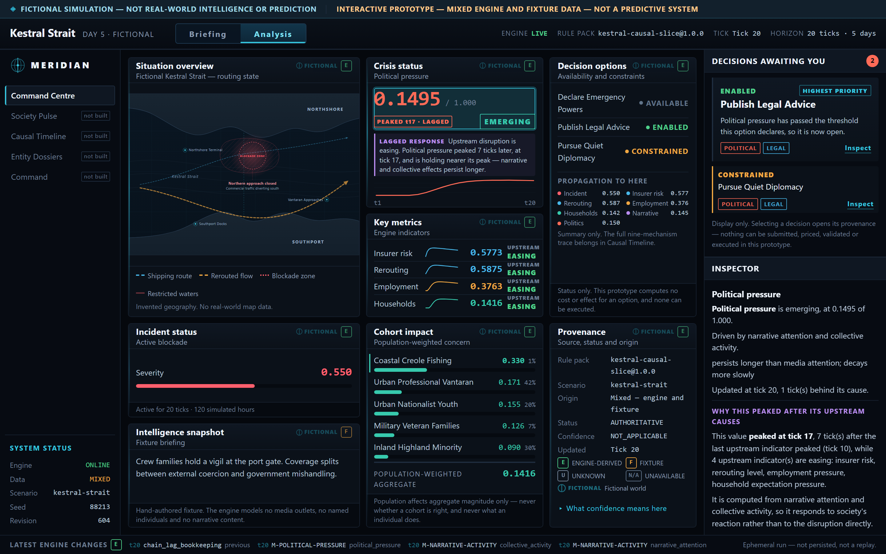

# Screenshots

Captures of the **current implementation**, produced by `scaffold/frontend/scripts/shots.mjs`, which
measures clipping, overflow, disclosure presence and origin markers as it captures.

Superseded images live in `scaffold/frontend/screenshots/archive/` and **do not represent the current
product**. Only images under `current/` may be used in public material.

## Briefing view — default

The default player experience: crisis map, plain-language situation summary, one primary decision,
and People / Economy / Politics consequence cards. Every sentence is derived from the run's own
state. 1440×900.

## Analysis view — technical inspection

The same run with the machinery visible: exact values, mechanism identifiers and versions,
rule-pack version, propagation summary, provenance, and the inspector. Reached through the visible
`Briefing / Analysis` switch.

## Planned

Tablet and narrow layouts, the Society Belief Landscape and Entity Dossier screens, and a decision
flow walkthrough are **not yet implemented** and are not shown here. Screens that do not exist are
marked *not built* in the interface rather than mocked.
